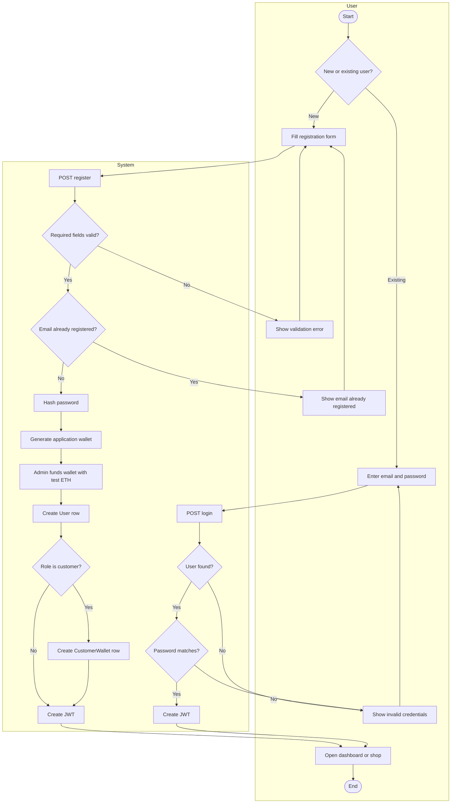
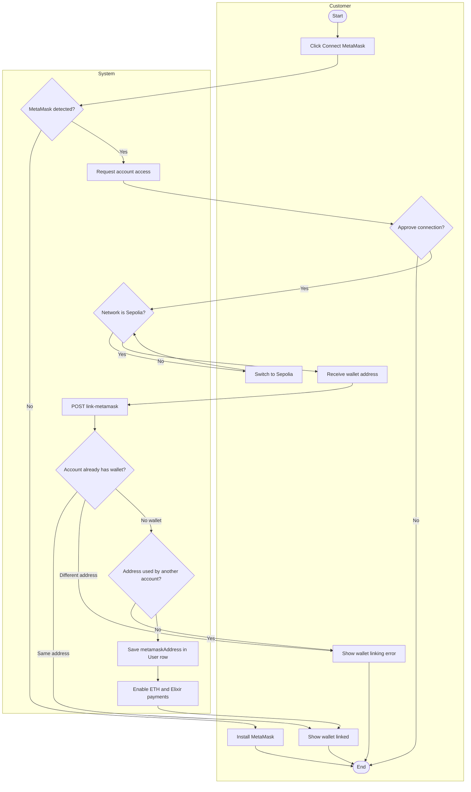
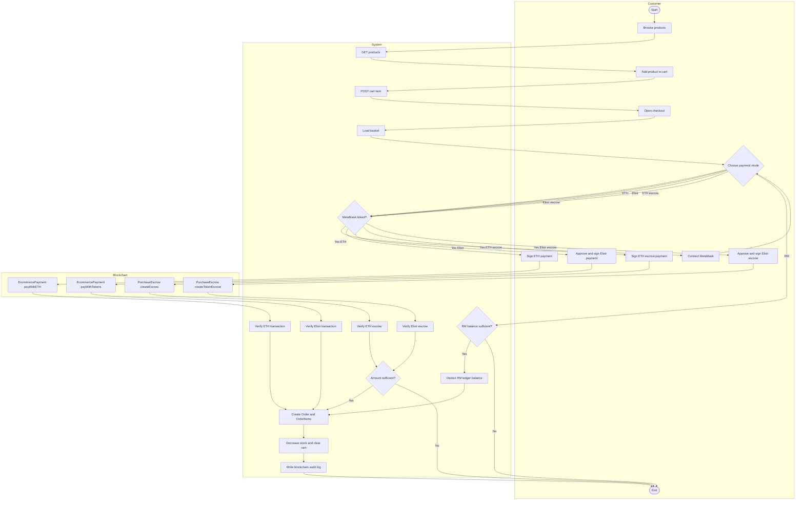
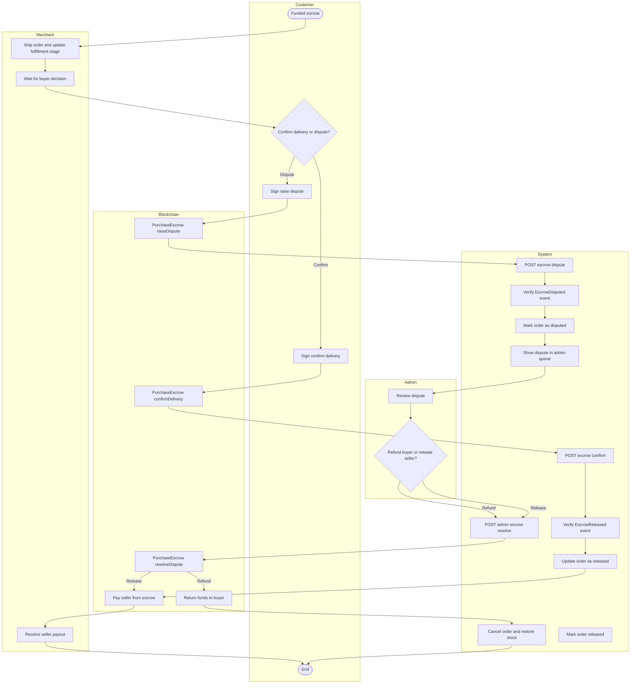
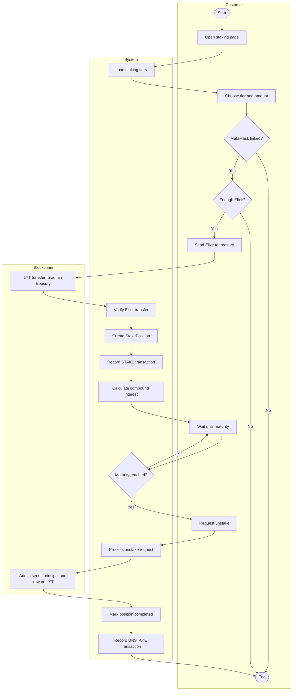
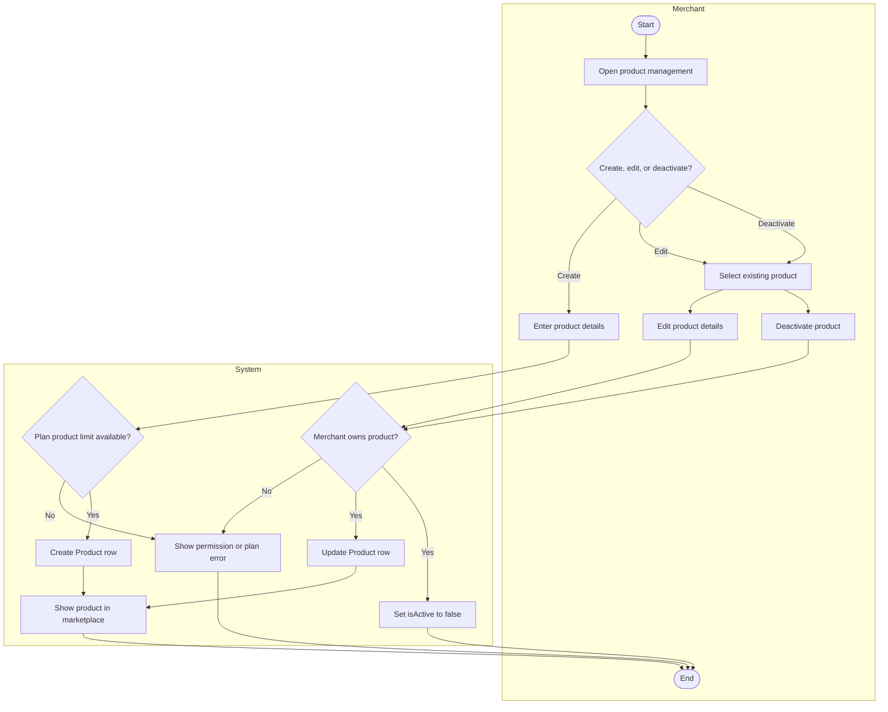
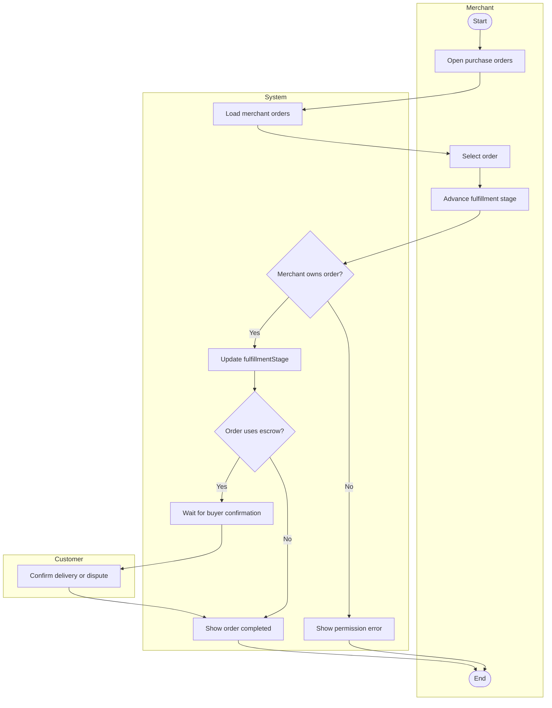
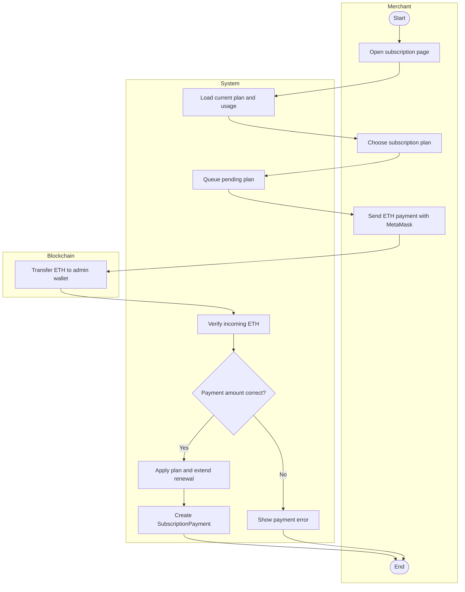
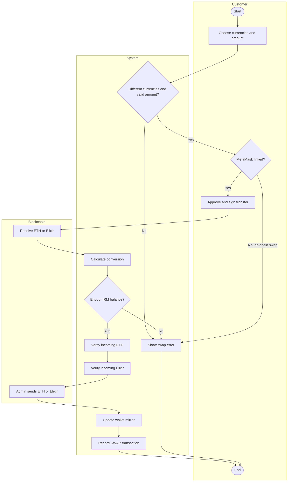

# Draw.io Activity Diagrams with Vertical Swimlanes

These versions are formatted for draw.io Mermaid insertion.

Use each diagram separately:

1. Open draw.io.
2. Select **Arrange → Insert → Mermaid**.
3. Copy only the code beginning with `graph TD`.
4. Do not copy Markdown fences or headings.
5. Click **Insert**.

All diagrams use vertical flow (`graph TD`) and swimlane containers using
`subgraph`. Labels use `<br/>` instead of `\n` for draw.io compatibility.

---

## 1. Registration and Login



---

## 2. Connect and Link MetaMask



---

## 3. Browse and Checkout



---

## 4. Escrow Confirmation, Dispute, and Resolution



---

## 5. Elixir Staking



---

## 6. Merchant Product Management



---

## 7. Merchant Order Fulfillment



---

## 8. Merchant Subscription Payment



---

## 9. Multi-Currency Swap



---

## Draw.io notes

- Use `graph TD` to keep the activity flow vertical.
- Keep the `subgraph UserLane[User]`, `subgraph SystemLane[System]`, and other role containers.
- Paste one diagram at a time.
- Do not paste the ` ```mermaid ` or closing ` ``` ` lines.
- If draw.io shows a parser error, remove `direction TB` lines first; the
  containers will still remain as swimlanes.
