# UML Diagrams — Blockchain E-Commerce Platform

These diagrams are generated directly from the actual codebase (Sequelize models,
Mongoose model, Express routes, and Solidity contracts), not a generic template.
They are written in [Mermaid](https://mermaid.js.org/) syntax so you can:

1. Preview them instantly in GitHub, VS Code (Markdown Preview Mermaid Support
   extension), or [mermaid.live](https://mermaid.live).
2. Import them into Figma as real, editable shapes using a plugin — see
   **"Getting these into Figma"** at the bottom of this file.

> Note on roles: this app does not use table-per-role inheritance. There is a
> single `users` table with a `role` ENUM(`customer`, `merchant`, `admin`).
> The three class diagrams below each show the **same `User` class** filtered
> to the fields/associations that matter for that role, plus the domain
> classes and smart contracts that role actually interacts with.

---

## 1. Class Diagram — Customer Role

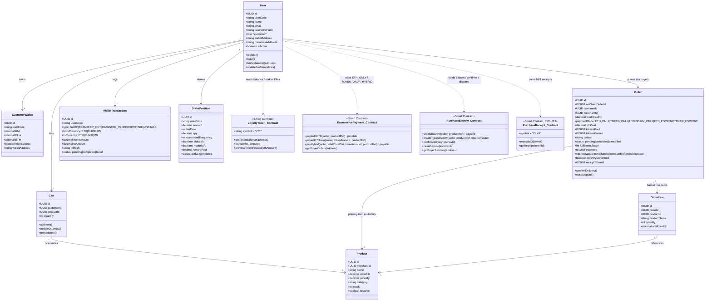

---

## 2. Class Diagram — Merchant (Seller) Role

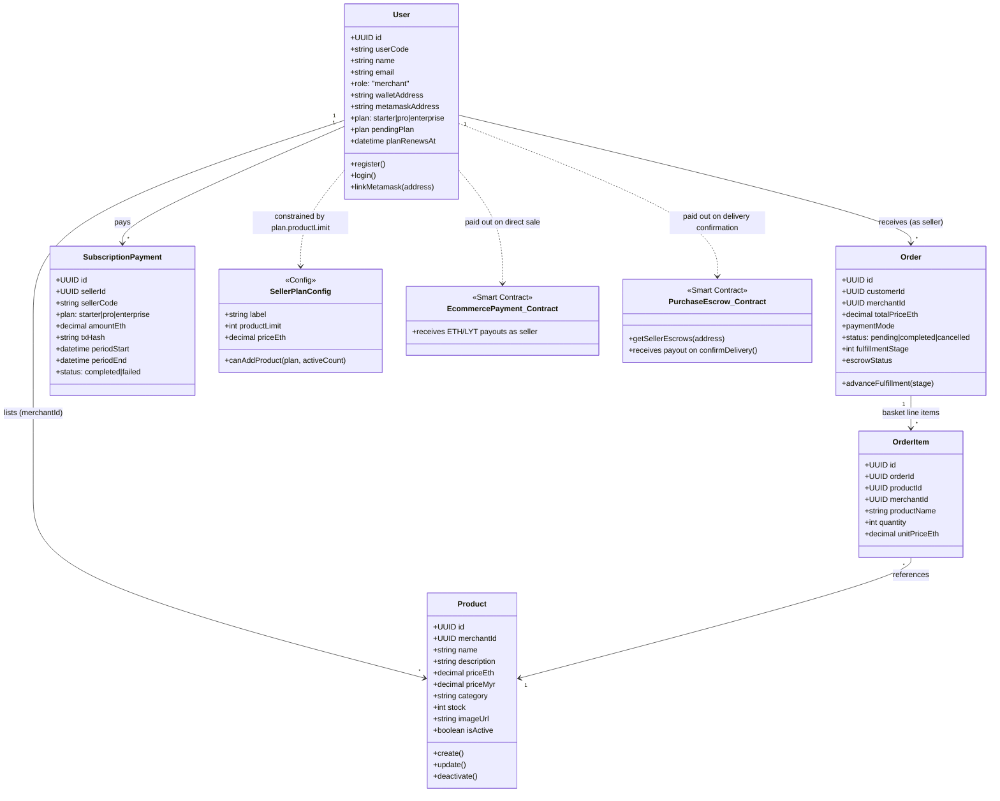

---

## 3. Class Diagram — Admin Role

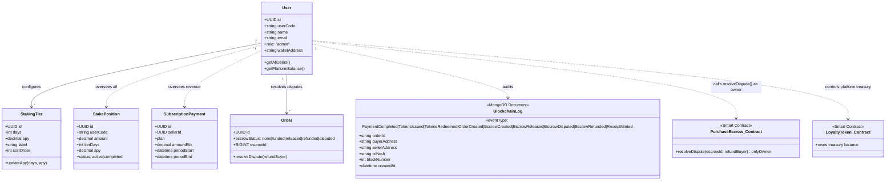

---

## 4. Activity Diagram — Registration & Login

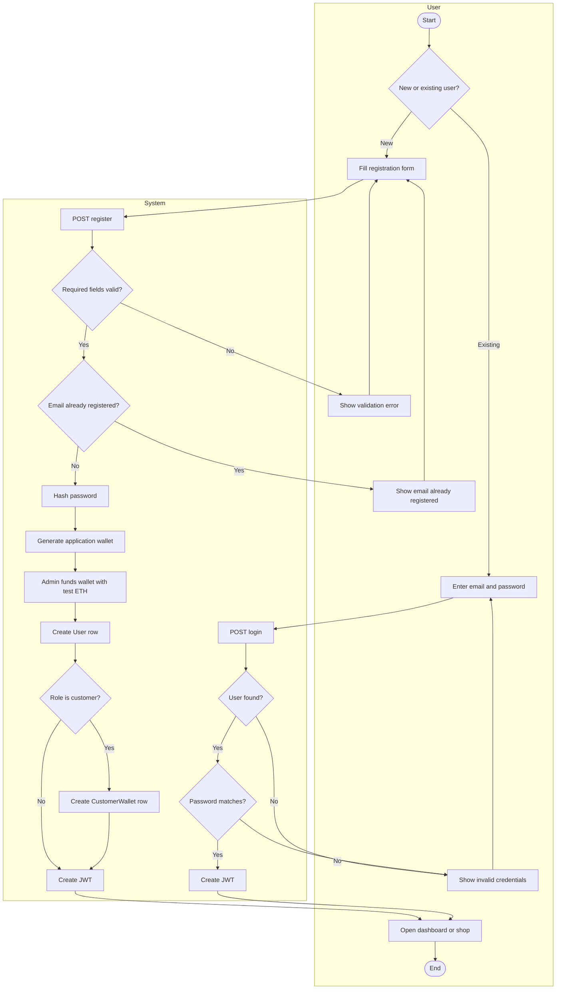

---

## 5. Activity Diagram — Connect & Link MetaMask

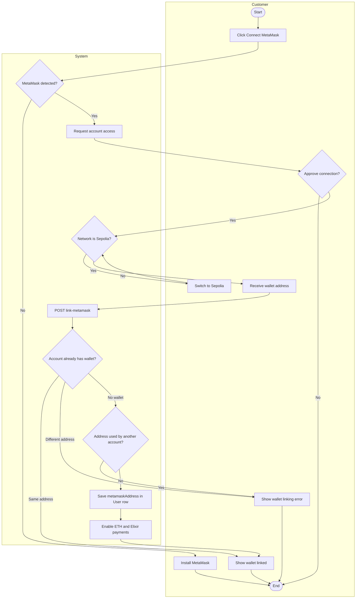

---

## 6. Activity Diagram — Browse & Checkout (all payment modes)

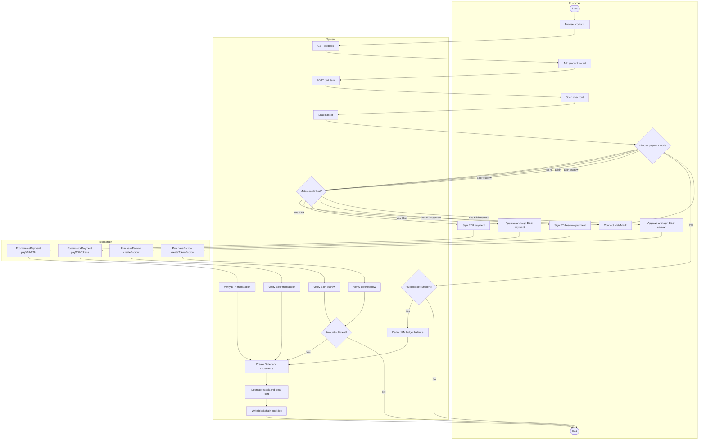

---

## 7. Activity Diagram — Escrow Confirmation, Dispute & Admin Resolution

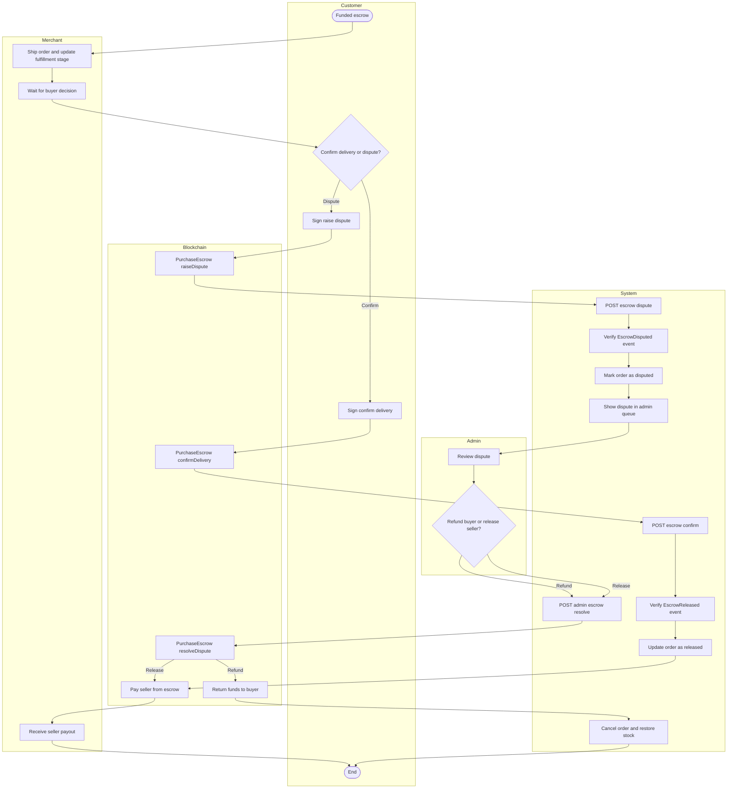

---

## 8. Activity Diagram — Elixir Staking (Stake & Unstake)

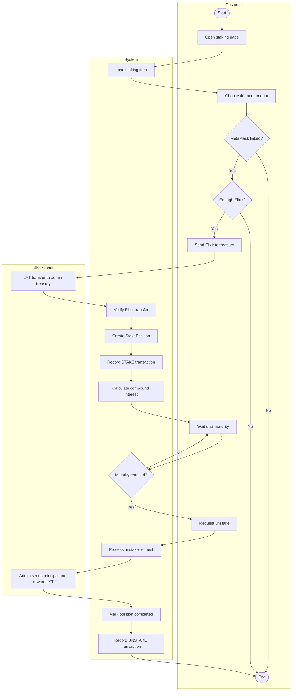

---

## 9. Activity Diagram — Seller Product Management

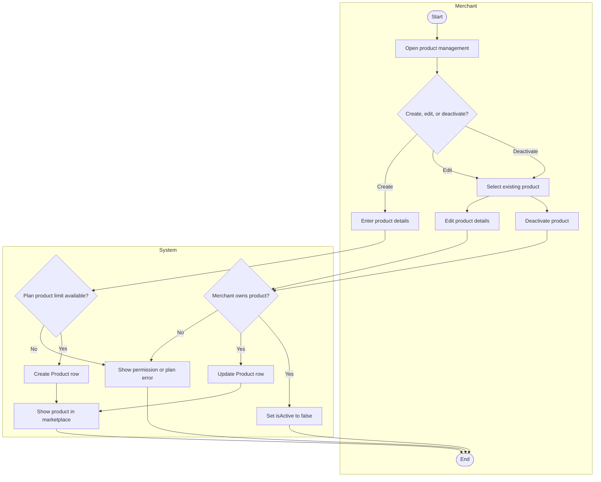

---

## 10. Activity Diagram — Seller Order Fulfillment

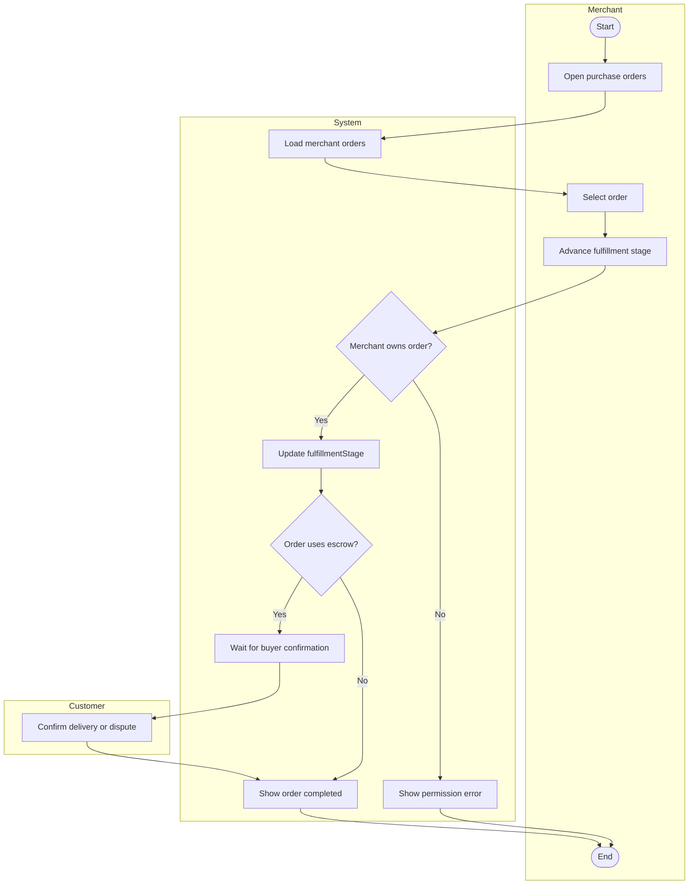

---

## 11. Activity Diagram — Seller Subscription Plan Change & Payment

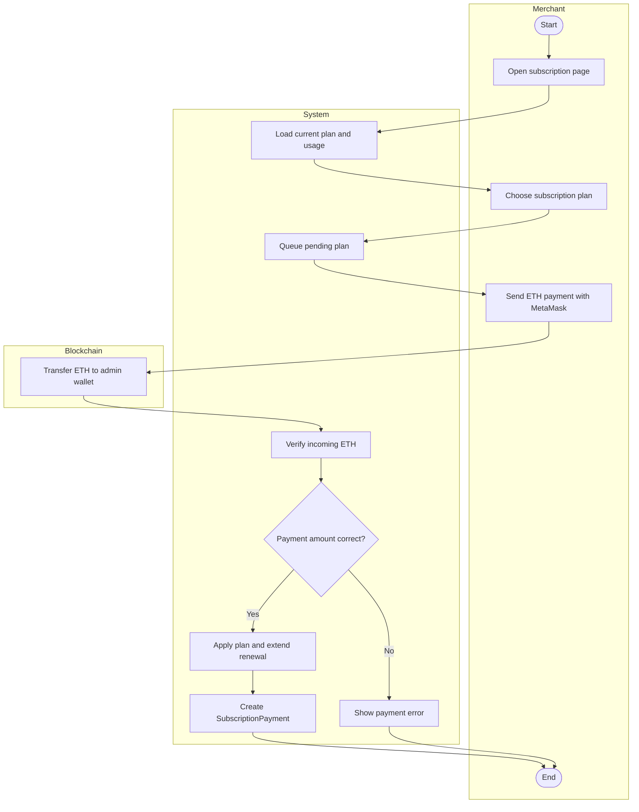

---

## 12. Activity Diagram — Multi-Currency Swap (ETH ⇄ Elixir ⇄ RM)

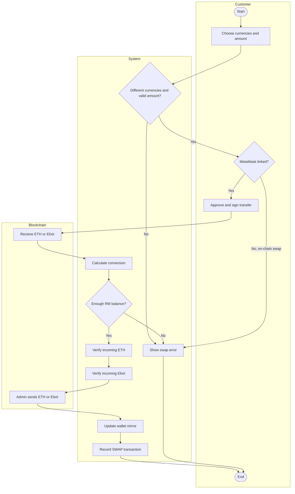

---

## Getting these into Figma

I don't have a tool that draws directly onto a Figma canvas — my Figma access
is read-only (I can pull data from an existing file or export images from it).
Generating a token with broader API scopes doesn't add that capability; it's
a tooling limitation, not a permissions one. Here's how to bring these Mermaid
diagrams into Figma yourself, in order of how close they get to fully native,
editable shapes:

1. **Mermaid Figma plugins (best fidelity):** In Figma, open
   **Resources → Plugins → search "Mermaid"**. Plugins such as *Mermaid
   Charts* or *Mermaid to Figma* let you paste the Mermaid code from a code
   block above directly and generate native Figma frames, shapes, and text
   layers you can then restyle.
2. **Render then trace/paste as image:** Paste any code block into
   [mermaid.live](https://mermaid.live), export as SVG, then in Figma use
   **File → Import** or drag the SVG in. Figma will convert it into editable
   vector layers (ungroup to adjust individual boxes/arrows).
3. **VS Code preview:** Install the "Markdown Preview Mermaid Support"
   extension, open `docs/diagrams.md`, and use the preview's built-in export
   (right-click a diagram → "Export image") if you just need a picture for a
   report rather than an editable Figma file.

If you tell me a specific diagram to prioritize, I can also produce a version
tuned for one of the Mermaid-to-Figma plugins if its input format differs
slightly from vanilla Mermaid syntax.

> **Draw.io swimlane version:** For vertical activity diagrams with User/System and role-specific swimlanes, use [`activity-diagrams-drawio.md`](./activity-diagrams-drawio.md). The diagrams in that file use `graph TD`, ` `, and draw.io-compatible Mermaid syntax.
