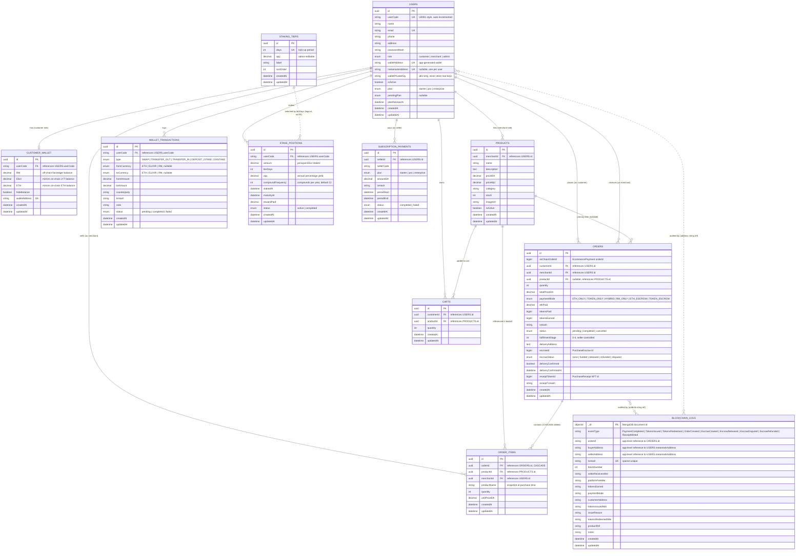

# Entity Relationship Diagram — Blockchain E-Commerce Platform

Generated directly from the actual schema in `backend/models/mysql.models.js`
(MySQL / Sequelize) and `backend/models/blockchainLog.model.js` (MongoDB /
Mongoose). Written in Mermaid `erDiagram` syntax.

`erDiagram` is a natively supported draw.io Mermaid type
(**Arrange → Insert → Mermaid**, paste starting from `erDiagram`, click
**Insert**). For Figma, export as SVG from [mermaid.live](https://mermaid.live)
and drag it onto the canvas — see the notes at the end of this file.

> Note: `blockchainlogs` is a MongoDB collection, not a MySQL table. It has
> no foreign key constraints, but it references orders and users by
> `orderId`/`buyerAddress`/`sellerAddress` as plain string fields (an
> application-level relationship, not an enforced one). It's included here
> as a dashed relationship to show how the "decentralised" audit log ties
> back to the relational data.

---

## Notes on the schema design

- **Single `users` table with a `role` column.** There is no
  table-per-role inheritance (no separate `customers`/`merchants`/`admins`
  tables). `role` is a MySQL ENUM(`customer`, `merchant`, `admin`), and
  role-specific fields (subscription `plan`, `pendingPlan`, `planRenewsAt`)
  live on the same row even though only merchants use them.
- **`CUSTOMER_WALLET` is 1:1 with `USERS`**, keyed by `userCode` rather than
  `id`. Only customer-role users get a wallet row (created in
  `ensureCustomerWalletRows()` at backend startup and in the registration
  transaction).
- **`ORDERS.productId` is nullable.** Single-item legacy checkouts
  (ETH_ONLY/TOKEN_ONLY) set it directly; multi-item basket checkouts
  (escrow/RM) leave it null and store line items in `ORDER_ITEMS` instead.
- **Money/token fields intentionally mix DB and on-chain sources of truth.**
  `CUSTOMER_WALLET.RM` is the authoritative ledger value. `CUSTOMER_WALLET.ETH`
  and `.Elixir` are mirrors of on-chain balances, refreshed opportunistically
  by routes like `GET /api/payment/wallet` — the blockchain itself remains
  the source of truth for those two.
- **`BLOCKCHAIN_LOGS` lives in MongoDB, not MySQL**, so it has no real
  foreign keys. Its `orderId`, `buyerAddress`, and `sellerAddress` fields are
  plain strings that happen to match `ORDERS.id` and `USERS.metamaskAddress`
  values — an application-level join, shown here as a dashed relationship.
- **Smart contracts are not part of this ERD.** `LoyaltyToken`,
  `EcommercePayment`, `PurchaseEscrow`, and `PurchaseReceipt` are on-chain
  state (Solidity storage), not rows in either database. Their relevant
  fields already appear in the class diagrams in `diagrams.md`.

---

## Getting this into draw.io or Figma

**draw.io:**
1. Open **Arrange → Insert → Mermaid**.
2. Paste the code above, starting from `erDiagram`.
3. Click **Insert**.

`erDiagram` is natively supported, so it should convert to native draw.io
entity tables directly. If any relationship label or crow's-foot notation
looks off, switch to the **Image** insert option.

**Figma:**
Same as the other diagrams — paste into
[mermaid.live](https://mermaid.live), export as SVG, and drag the file onto
your Figma canvas, since I don't have a tool that draws directly onto a
Figma canvas.
