# Sequence Diagrams — Blockchain E-Commerce Platform

These sequence diagrams are generated from the actual codebase: Express
routes, Sequelize/Mongoose models, `blockchainService` helper calls, and the
Solidity contracts (`LoyaltyToken`, `EcommercePayment`, `PurchaseEscrow`,
`PurchaseReceipt`). They cover the same workflows as the activity diagrams in
`diagrams.md`, but show the message-passing between participants over time
rather than the decision branches.

Written in [Mermaid](https://mermaid.js.org/) `sequenceDiagram` syntax.
`sequenceDiagram` is one of draw.io's natively supported Mermaid diagram
types, so **Arrange → Insert → Mermaid** should render these directly without
falling back to an unsupported-type error. If a container/lifeline still
looks wrong, use the **Image** insert option or paste into
[mermaid.live](https://mermaid.live) and drag in the exported SVG — see the
notes at the end of this file.

Common participants across diagrams:

- **Customer / Merchant / Admin** — the human actor (browser)
- **Frontend** — the React app (`frontend/src`)
- **Backend** — the Express API (`backend/routes/*.routes.js`)
- **MySQL** — Sequelize models (`backend/models/mysql.models.js`)
- **MongoDB** — `BlockchainLog` audit collection
- **MetaMask** — the browser wallet extension signing transactions
- **Contract** — the relevant Solidity contract on Sepolia

---

## 1. Registration

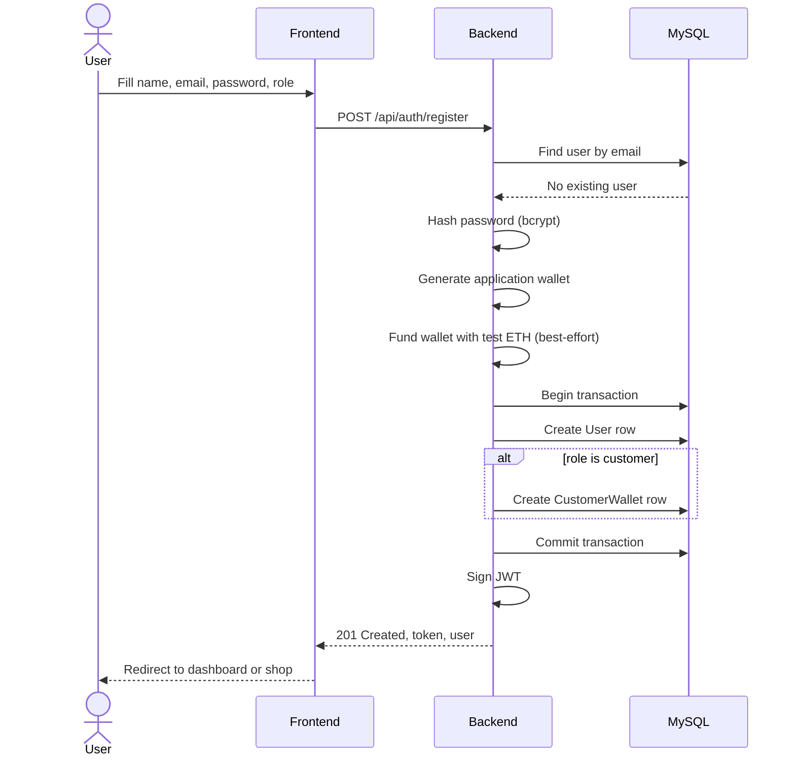
```mermaid
sequenceDiagram
    actor User
    participant FE as Frontend
    participant BE as Backend
    participant DB as MySQL

    User->>FE: Fill name, email, password, role
    FE->>BE: POST /api/auth/register
    BE->>DB: Find user by email
    DB-->>BE: No existing user
    BE->>BE: Hash password (bcrypt)
    BE->>BE: Generate application wallet
    BE->>BE: Fund wallet with test ETH (best-effort)
    BE->>DB: Begin transaction
    BE->>DB: Create User row
    alt role is customer
        BE->>DB: Create CustomerWallet row
    end
    BE->>DB: Commit transaction
    BE->>BE: Sign JWT
    BE-->>FE: 201 Created, token, user
    FE-->>User: Redirect to dashboard or shop
```

---

## 2. Login

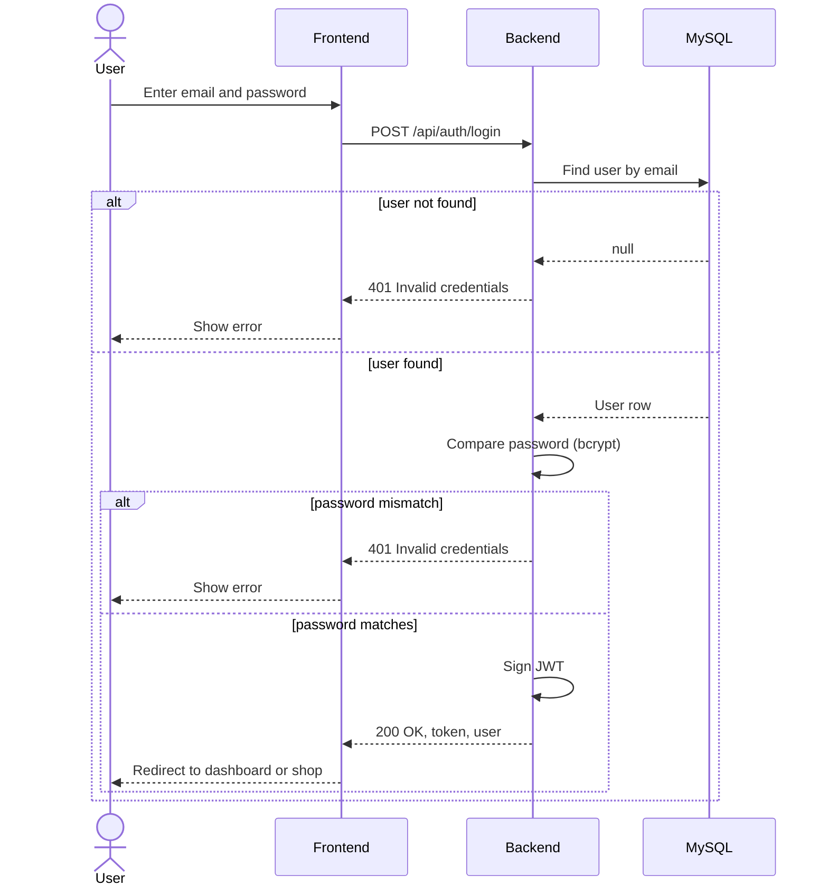
```mermaid
sequenceDiagram
    actor User
    participant FE as Frontend
    participant BE as Backend
    participant DB as MySQL

    User->>FE: Enter email and password
    FE->>BE: POST /api/auth/login
    BE->>DB: Find user by email
    alt user not found
        DB-->>BE: null
        BE-->>FE: 401 Invalid credentials
        FE-->>User: Show error
    else user found
        DB-->>BE: User row
        BE->>BE: Compare password (bcrypt)
        alt password mismatch
            BE-->>FE: 401 Invalid credentials
            FE-->>User: Show error
        else password matches
            BE->>BE: Sign JWT
            BE-->>FE: 200 OK, token, user
            FE-->>User: Redirect to dashboard or shop
        end
    end
```

---

## 3. Connect and Link MetaMask

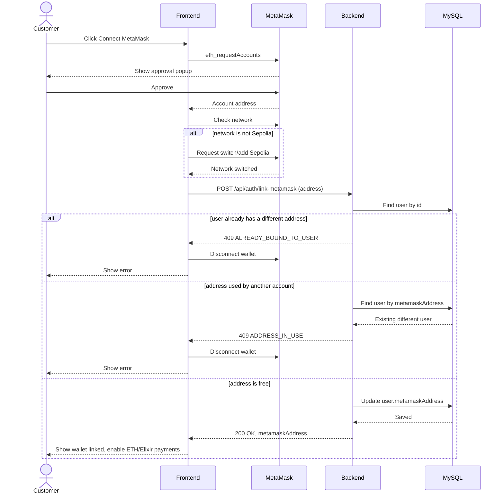
```mermaid
sequenceDiagram
    actor Customer
    participant FE as Frontend
    participant MM as MetaMask
    participant BE as Backend
    participant DB as MySQL

    Customer->>FE: Click Connect MetaMask
    FE->>MM: eth_requestAccounts
    MM-->>Customer: Show approval popup
    Customer->>MM: Approve
    MM-->>FE: Account address
    FE->>MM: Check network
    alt network is not Sepolia
        FE->>MM: Request switch/add Sepolia
        MM-->>FE: Network switched
    end
    FE->>BE: POST /api/auth/link-metamask (address)
    BE->>DB: Find user by id
    alt user already has a different address
        BE-->>FE: 409 ALREADY_BOUND_TO_USER
        FE->>MM: Disconnect wallet
        FE-->>Customer: Show error
    else address used by another account
        BE->>DB: Find user by metamaskAddress
        DB-->>BE: Existing different user
        BE-->>FE: 409 ADDRESS_IN_USE
        FE->>MM: Disconnect wallet
        FE-->>Customer: Show error
    else address is free
        BE->>DB: Update user.metamaskAddress
        DB-->>BE: Saved
        BE-->>FE: 200 OK, metamaskAddress
        FE-->>Customer: Show wallet linked, enable ETH/Elixir payments
    end
```

---

## 4. Checkout — ETH Only

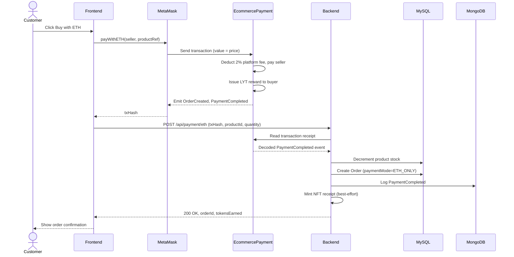
```mermaid
sequenceDiagram
    actor Customer
    participant FE as Frontend
    participant MM as MetaMask
    participant EP as EcommercePayment
    participant BE as Backend
    participant DB as MySQL
    participant Mongo as MongoDB

    Customer->>FE: Click Buy with ETH
    FE->>MM: payWithETH(seller, productRef)
    MM->>EP: Send transaction (value = price)
    EP->>EP: Deduct 2% platform fee, pay seller
    EP->>EP: Issue LYT reward to buyer
    EP-->>MM: Emit OrderCreated, PaymentCompleted
    MM-->>FE: txHash
    FE->>BE: POST /api/payment/eth (txHash, productId, quantity)
    BE->>EP: Read transaction receipt
    EP-->>BE: Decoded PaymentCompleted event
    BE->>DB: Decrement product stock
    BE->>DB: Create Order (paymentMode=ETH_ONLY)
    BE->>Mongo: Log PaymentCompleted
    BE->>BE: Mint NFT receipt (best-effort)
    BE-->>FE: 200 OK, orderId, tokensEarned
    FE-->>Customer: Show order confirmation
```

---

## 5. Checkout — Elixir (Token) Only

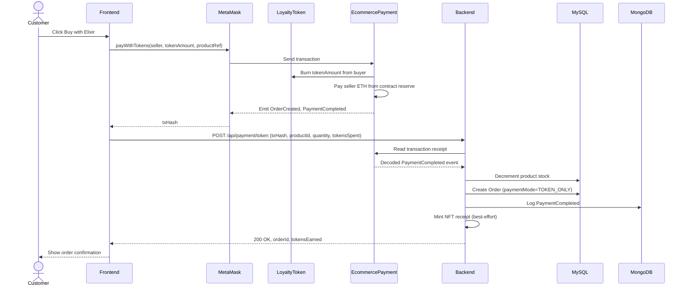
```mermaid
sequenceDiagram
    actor Customer
    participant FE as Frontend
    participant MM as MetaMask
    participant LT as LoyaltyToken
    participant EP as EcommercePayment
    participant BE as Backend
    participant DB as MySQL
    participant Mongo as MongoDB

    Customer->>FE: Click Buy with Elixir
    FE->>MM: payWithTokens(seller, tokenAmount, productRef)
    MM->>EP: Send transaction
    EP->>LT: Burn tokenAmount from buyer
    EP->>EP: Pay seller ETH from contract reserve
    EP-->>MM: Emit OrderCreated, PaymentCompleted
    MM-->>FE: txHash
    FE->>BE: POST /api/payment/token (txHash, productId, quantity, tokensSpent)
    BE->>EP: Read transaction receipt
    EP-->>BE: Decoded PaymentCompleted event
    BE->>DB: Decrement product stock
    BE->>DB: Create Order (paymentMode=TOKEN_ONLY)
    BE->>Mongo: Log PaymentCompleted
    BE->>BE: Mint NFT receipt (best-effort)
    BE-->>FE: 200 OK, orderId, tokensEarned
    FE-->>Customer: Show order confirmation
```

---

## 6. Checkout — ETH Escrow (Basket)

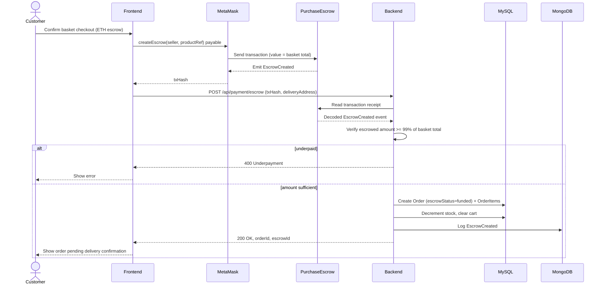
```mermaid
sequenceDiagram
    actor Customer
    participant FE as Frontend
    participant MM as MetaMask
    participant PE as PurchaseEscrow
    participant BE as Backend
    participant DB as MySQL
    participant Mongo as MongoDB

    Customer->>FE: Confirm basket checkout (ETH escrow)
    FE->>MM: createEscrow(seller, productRef) payable
    MM->>PE: Send transaction (value = basket total)
    PE-->>MM: Emit EscrowCreated
    MM-->>FE: txHash
    FE->>BE: POST /api/payment/escrow (txHash, deliveryAddress)
    BE->>PE: Read transaction receipt
    PE-->>BE: Decoded EscrowCreated event
    BE->>BE: Verify escrowed amount >= 99% of basket total
    alt underpaid
        BE-->>FE: 400 Underpayment
        FE-->>Customer: Show error
    else amount sufficient
        BE->>DB: Create Order (escrowStatus=funded) + OrderItems
        BE->>DB: Decrement stock, clear cart
        BE->>Mongo: Log EscrowCreated
        BE-->>FE: 200 OK, orderId, escrowId
        FE-->>Customer: Show order pending delivery confirmation
    end
```

---

## 7. Checkout — Elixir Escrow (Basket)

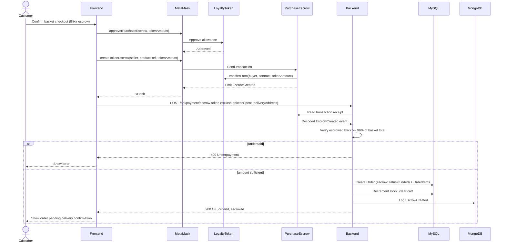
```mermaid
sequenceDiagram
    actor Customer
    participant FE as Frontend
    participant MM as MetaMask
    participant LT as LoyaltyToken
    participant PE as PurchaseEscrow
    participant BE as Backend
    participant DB as MySQL
    participant Mongo as MongoDB

    Customer->>FE: Confirm basket checkout (Elixir escrow)
    FE->>MM: approve(PurchaseEscrow, tokenAmount)
    MM->>LT: Approve allowance
    LT-->>MM: Approved
    FE->>MM: createTokenEscrow(seller, productRef, tokenAmount)
    MM->>PE: Send transaction
    PE->>LT: transferFrom(buyer, contract, tokenAmount)
    PE-->>MM: Emit EscrowCreated
    MM-->>FE: txHash
    FE->>BE: POST /api/payment/escrow-token (txHash, tokensSpent, deliveryAddress)
    BE->>PE: Read transaction receipt
    PE-->>BE: Decoded EscrowCreated event
    BE->>BE: Verify escrowed Elixir >= 99% of basket total
    alt underpaid
        BE-->>FE: 400 Underpayment
        FE-->>Customer: Show error
    else amount sufficient
        BE->>DB: Create Order (escrowStatus=funded) + OrderItems
        BE->>DB: Decrement stock, clear cart
        BE->>Mongo: Log EscrowCreated
        BE-->>FE: 200 OK, orderId, escrowId
        FE-->>Customer: Show order pending delivery confirmation
    end
```

---

## 8. Checkout — RM Ledger (No Blockchain)

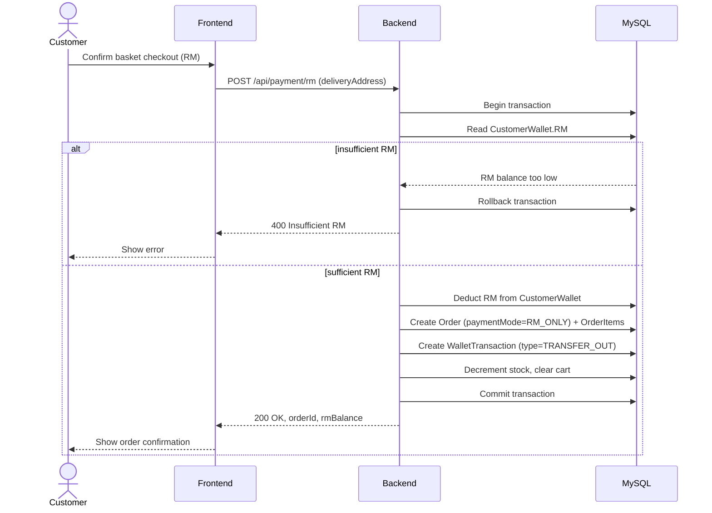
```mermaid
sequenceDiagram
    actor Customer
    participant FE as Frontend
    participant BE as Backend
    participant DB as MySQL

    Customer->>FE: Confirm basket checkout (RM)
    FE->>BE: POST /api/payment/rm (deliveryAddress)
    BE->>DB: Begin transaction
    BE->>DB: Read CustomerWallet.RM
    alt insufficient RM
        DB-->>BE: RM balance too low
        BE->>DB: Rollback transaction
        BE-->>FE: 400 Insufficient RM
        FE-->>Customer: Show error
    else sufficient RM
        BE->>DB: Deduct RM from CustomerWallet
        BE->>DB: Create Order (paymentMode=RM_ONLY) + OrderItems
        BE->>DB: Create WalletTransaction (type=TRANSFER_OUT)
        BE->>DB: Decrement stock, clear cart
        BE->>DB: Commit transaction
        BE-->>FE: 200 OK, orderId, rmBalance
        FE-->>Customer: Show order confirmation
    end
```

---

## 9. Escrow Delivery Confirmation

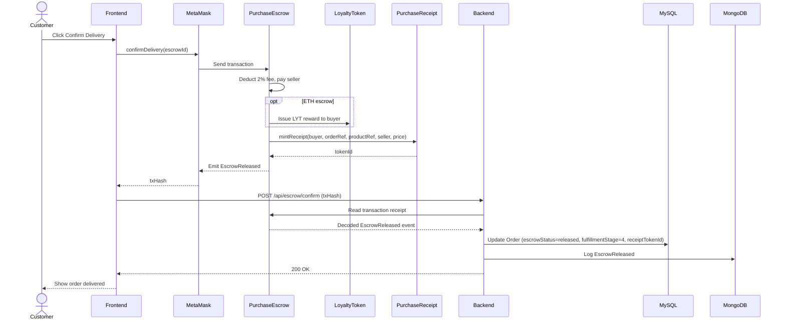
```mermaid
sequenceDiagram
    actor Customer
    participant FE as Frontend
    participant MM as MetaMask
    participant PE as PurchaseEscrow
    participant LT as LoyaltyToken
    participant PR as PurchaseReceipt
    participant BE as Backend
    participant DB as MySQL
    participant Mongo as MongoDB

    Customer->>FE: Click Confirm Delivery
    FE->>MM: confirmDelivery(escrowId)
    MM->>PE: Send transaction
    PE->>PE: Deduct 2% fee, pay seller
    opt ETH escrow
        PE->>LT: Issue LYT reward to buyer
    end
    PE->>PR: mintReceipt(buyer, orderRef, productRef, seller, price)
    PR-->>PE: tokenId
    PE-->>MM: Emit EscrowReleased
    MM-->>FE: txHash
    FE->>BE: POST /api/escrow/confirm (txHash)
    BE->>PE: Read transaction receipt
    PE-->>BE: Decoded EscrowReleased event
    BE->>DB: Update Order (escrowStatus=released, fulfillmentStage=4, receiptTokenId)
    BE->>Mongo: Log EscrowReleased
    BE-->>FE: 200 OK
    FE-->>Customer: Show order delivered
```

---

## 10. Escrow Dispute and Admin Resolution

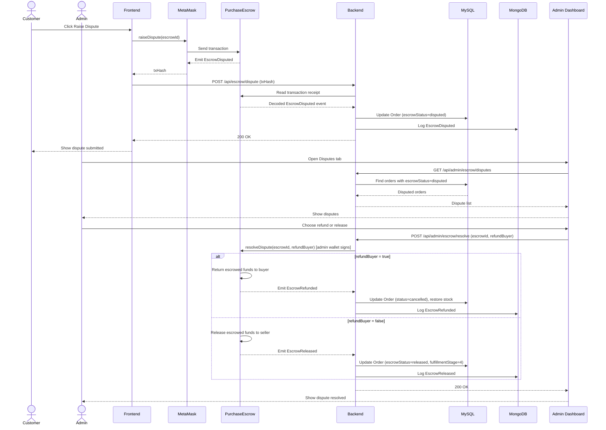
```mermaid
sequenceDiagram
    actor Customer
    actor Admin
    participant FE as Frontend
    participant MM as MetaMask
    participant PE as PurchaseEscrow
    participant BE as Backend
    participant DB as MySQL
    participant Mongo as MongoDB
    participant AdminFE as Admin Dashboard

    Customer->>FE: Click Raise Dispute
    FE->>MM: raiseDispute(escrowId)
    MM->>PE: Send transaction
    PE-->>MM: Emit EscrowDisputed
    MM-->>FE: txHash
    FE->>BE: POST /api/escrow/dispute (txHash)
    BE->>PE: Read transaction receipt
    PE-->>BE: Decoded EscrowDisputed event
    BE->>DB: Update Order (escrowStatus=disputed)
    BE->>Mongo: Log EscrowDisputed
    BE-->>FE: 200 OK
    FE-->>Customer: Show dispute submitted

    Admin->>AdminFE: Open Disputes tab
    AdminFE->>BE: GET /api/admin/escrow/disputes
    BE->>DB: Find orders with escrowStatus=disputed
    DB-->>BE: Disputed orders
    BE-->>AdminFE: Dispute list
    AdminFE-->>Admin: Show disputes

    Admin->>AdminFE: Choose refund or release
    AdminFE->>BE: POST /api/admin/escrow/resolve (escrowId, refundBuyer)
    BE->>PE: resolveDispute(escrowId, refundBuyer) [admin wallet signs]
    alt refundBuyer = true
        PE->>PE: Return escrowed funds to buyer
        PE-->>BE: Emit EscrowRefunded
        BE->>DB: Update Order (status=cancelled), restore stock
        BE->>Mongo: Log EscrowRefunded
    else refundBuyer = false
        PE->>PE: Release escrowed funds to seller
        PE-->>BE: Emit EscrowReleased
        BE->>DB: Update Order (escrowStatus=released, fulfillmentStage=4)
        BE->>Mongo: Log EscrowReleased
    end
    BE-->>AdminFE: 200 OK
    AdminFE-->>Admin: Show dispute resolved
```

---

## 11. Elixir Staking — Stake

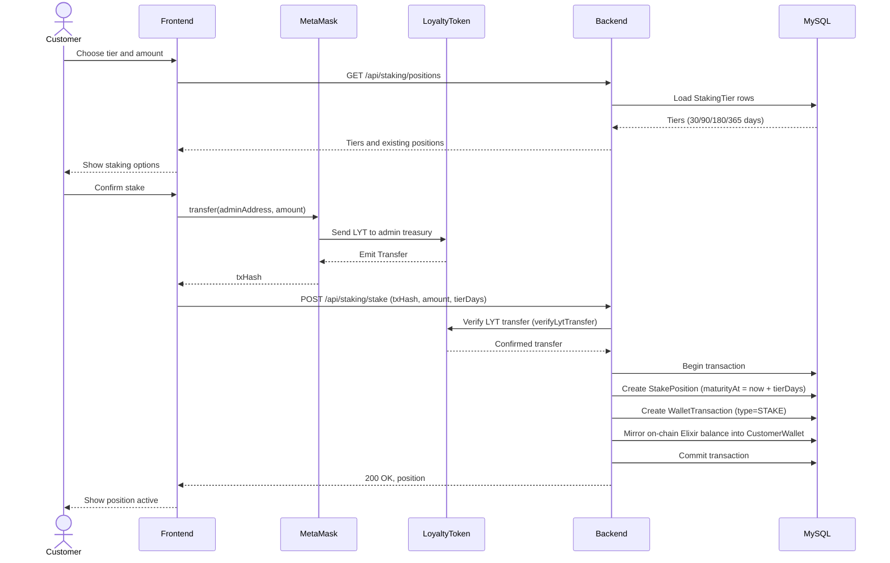
```mermaid
sequenceDiagram
    actor Customer
    participant FE as Frontend
    participant MM as MetaMask
    participant LT as LoyaltyToken
    participant BE as Backend
    participant DB as MySQL

    Customer->>FE: Choose tier and amount
    FE->>BE: GET /api/staking/positions
    BE->>DB: Load StakingTier rows
    DB-->>BE: Tiers (30/90/180/365 days)
    BE-->>FE: Tiers and existing positions
    FE-->>Customer: Show staking options

    Customer->>FE: Confirm stake
    FE->>MM: transfer(adminAddress, amount)
    MM->>LT: Send LYT to admin treasury
    LT-->>MM: Emit Transfer
    MM-->>FE: txHash
    FE->>BE: POST /api/staking/stake (txHash, amount, tierDays)
    BE->>LT: Verify LYT transfer (verifyLytTransfer)
    LT-->>BE: Confirmed transfer
    BE->>DB: Begin transaction
    BE->>DB: Create StakePosition (maturityAt = now + tierDays)
    BE->>DB: Create WalletTransaction (type=STAKE)
    BE->>DB: Mirror on-chain Elixir balance into CustomerWallet
    BE->>DB: Commit transaction
    BE-->>FE: 200 OK, position
    FE-->>Customer: Show position active
```

---

## 12. Elixir Staking — Unstake

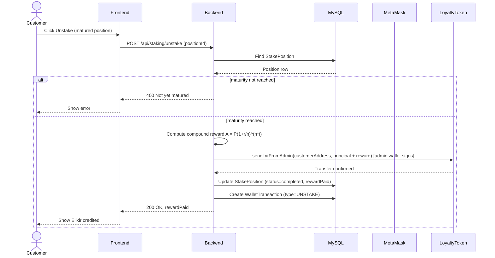
```mermaid
sequenceDiagram
    actor Customer
    participant FE as Frontend
    participant BE as Backend
    participant DB as MySQL
    participant MM as MetaMask
    participant LT as LoyaltyToken

    Customer->>FE: Click Unstake (matured position)
    FE->>BE: POST /api/staking/unstake (positionId)
    BE->>DB: Find StakePosition
    DB-->>BE: Position row
    alt maturity not reached
        BE-->>FE: 400 Not yet matured
        FE-->>Customer: Show error
    else maturity reached
        BE->>BE: Compute compound reward A = P(1+r/n)^(n*t)
        BE->>LT: sendLytFromAdmin(customerAddress, principal + reward) [admin wallet signs]
        LT-->>BE: Transfer confirmed
        BE->>DB: Update StakePosition (status=completed, rewardPaid)
        BE->>DB: Create WalletTransaction (type=UNSTAKE)
        BE-->>FE: 200 OK, rewardPaid
        FE-->>Customer: Show Elixir credited
    end
```

---

## 13. Merchant Product Management

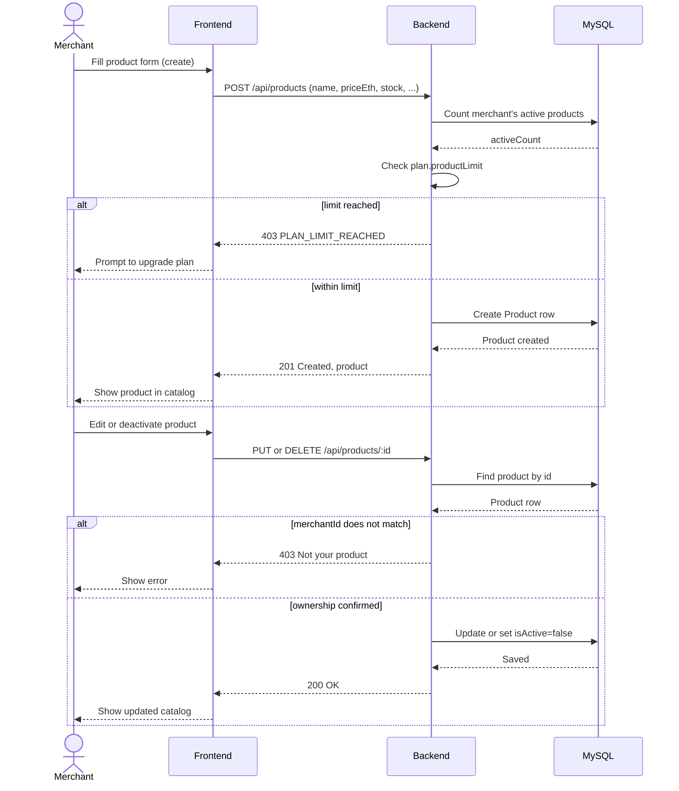
```mermaid
sequenceDiagram
    actor Merchant
    participant FE as Frontend
    participant BE as Backend
    participant DB as MySQL

    Merchant->>FE: Fill product form (create)
    FE->>BE: POST /api/products (name, priceEth, stock, ...)
    BE->>DB: Count merchant's active products
    DB-->>BE: activeCount
    BE->>BE: Check plan.productLimit
    alt limit reached
        BE-->>FE: 403 PLAN_LIMIT_REACHED
        FE-->>Merchant: Prompt to upgrade plan
    else within limit
        BE->>DB: Create Product row
        DB-->>BE: Product created
        BE-->>FE: 201 Created, product
        FE-->>Merchant: Show product in catalog
    end

    Merchant->>FE: Edit or deactivate product
    FE->>BE: PUT or DELETE /api/products/:id
    BE->>DB: Find product by id
    DB-->>BE: Product row
    alt merchantId does not match
        BE-->>FE: 403 Not your product
        FE-->>Merchant: Show error
    else ownership confirmed
        BE->>DB: Update or set isActive=false
        DB-->>BE: Saved
        BE-->>FE: 200 OK
        FE-->>Merchant: Show updated catalog
    end
```

---

## 14. Merchant Order Fulfillment

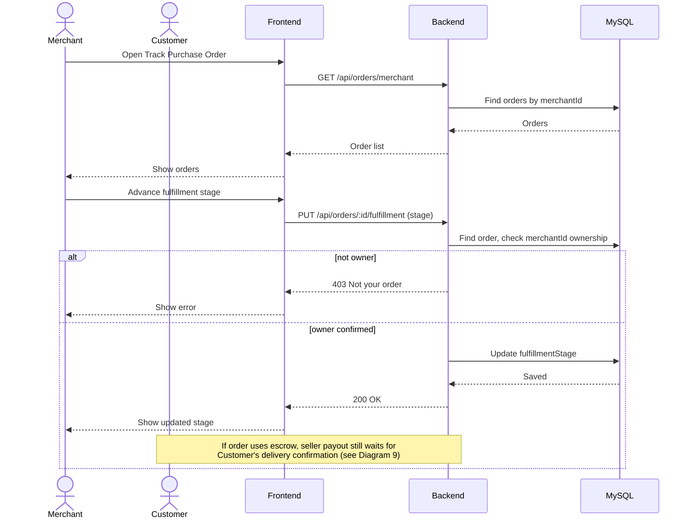
```mermaid
sequenceDiagram
    actor Merchant
    actor Customer
    participant FE as Frontend
    participant BE as Backend
    participant DB as MySQL

    Merchant->>FE: Open Track Purchase Order
    FE->>BE: GET /api/orders/merchant
    BE->>DB: Find orders by merchantId
    DB-->>BE: Orders
    BE-->>FE: Order list
    FE-->>Merchant: Show orders

    Merchant->>FE: Advance fulfillment stage
    FE->>BE: PUT /api/orders/:id/fulfillment (stage)
    BE->>DB: Find order, check merchantId ownership
    alt not owner
        BE-->>FE: 403 Not your order
        FE-->>Merchant: Show error
    else owner confirmed
        BE->>DB: Update fulfillmentStage
        DB-->>BE: Saved
        BE-->>FE: 200 OK
        FE-->>Merchant: Show updated stage
        note over Customer,BE: If order uses escrow, seller payout still waits for<br/>Customer's delivery confirmation (see Diagram 9)
    end
```

---

## 15. Merchant Subscription Payment

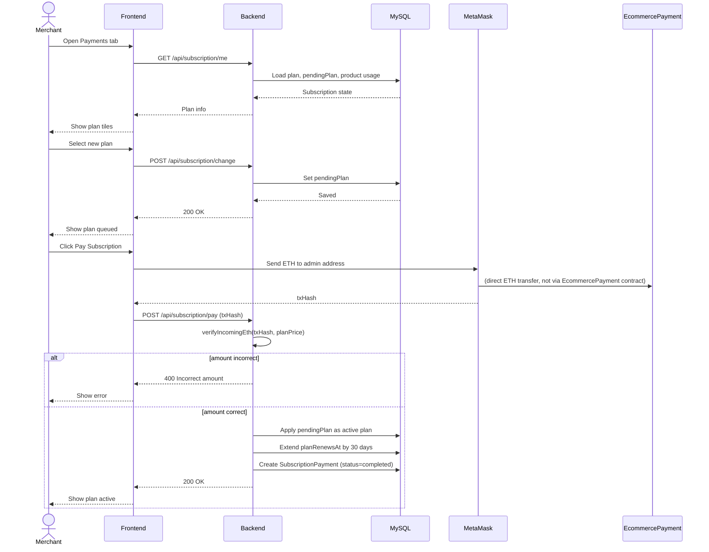
```mermaid
sequenceDiagram
    actor Merchant
    participant FE as Frontend
    participant BE as Backend
    participant DB as MySQL
    participant MM as MetaMask
    participant EP as EcommercePayment

    Merchant->>FE: Open Payments tab
    FE->>BE: GET /api/subscription/me
    BE->>DB: Load plan, pendingPlan, product usage
    DB-->>BE: Subscription state
    BE-->>FE: Plan info
    FE-->>Merchant: Show plan tiles

    Merchant->>FE: Select new plan
    FE->>BE: POST /api/subscription/change
    BE->>DB: Set pendingPlan
    DB-->>BE: Saved
    BE-->>FE: 200 OK
    FE-->>Merchant: Show plan queued

    Merchant->>FE: Click Pay Subscription
    FE->>MM: Send ETH to admin address
    MM->>EP: (direct ETH transfer, not via EcommercePayment contract)
    MM-->>FE: txHash
    FE->>BE: POST /api/subscription/pay (txHash)
    BE->>BE: verifyIncomingEth(txHash, planPrice)
    alt amount incorrect
        BE-->>FE: 400 Incorrect amount
        FE-->>Merchant: Show error
    else amount correct
        BE->>DB: Apply pendingPlan as active plan
        BE->>DB: Extend planRenewsAt by 30 days
        BE->>DB: Create SubscriptionPayment (status=completed)
        BE-->>FE: 200 OK
        FE-->>Merchant: Show plan active
    end
```

---

## 16. Multi-Currency Swap (ETH / Elixir / RM)

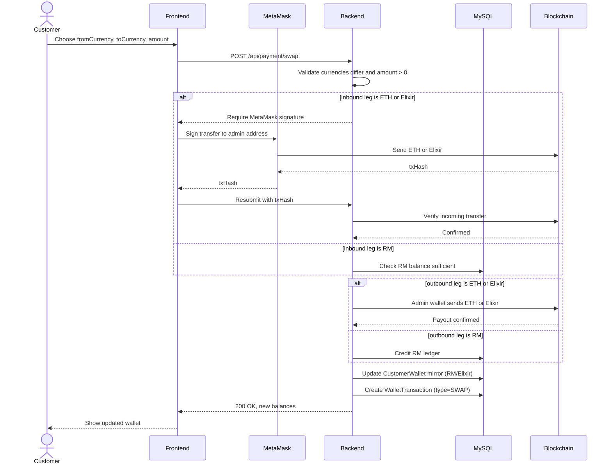
```mermaid
sequenceDiagram
    actor Customer
    participant FE as Frontend
    participant MM as MetaMask
    participant BE as Backend
    participant DB as MySQL
    participant Chain as Blockchain

    Customer->>FE: Choose fromCurrency, toCurrency, amount
    FE->>BE: POST /api/payment/swap
    BE->>BE: Validate currencies differ and amount > 0
    alt inbound leg is ETH or Elixir
        BE-->>FE: Require MetaMask signature
        FE->>MM: Sign transfer to admin address
        MM->>Chain: Send ETH or Elixir
        Chain-->>MM: txHash
        MM-->>FE: txHash
        FE->>BE: Resubmit with txHash
        BE->>Chain: Verify incoming transfer
        Chain-->>BE: Confirmed
    else inbound leg is RM
        BE->>DB: Check RM balance sufficient
    end
    alt outbound leg is ETH or Elixir
        BE->>Chain: Admin wallet sends ETH or Elixir
        Chain-->>BE: Payout confirmed
    else outbound leg is RM
        BE->>DB: Credit RM ledger
    end
    BE->>DB: Update CustomerWallet mirror (RM/Elixir)
    BE->>DB: Create WalletTransaction (type=SWAP)
    BE-->>FE: 200 OK, new balances
    FE-->>Customer: Show updated wallet
```

---

## Getting these into draw.io or Figma

**draw.io:**
1. Open **Arrange → Insert → Mermaid**.
2. Paste one diagram's code, starting from `sequenceDiagram`.
3. Click **Insert**.

`sequenceDiagram` is a natively supported draw.io Mermaid type, so this
should convert cleanly. If lifelines or notes look wrong, switch the insert
option to **Image**, or use the mermaid.live → export SVG → drag-in method
described in `activity-diagrams-drawio.md`.

**Figma:**
Same approach as the class/activity diagrams — I don't have a tool that
draws directly on a Figma canvas. Paste into
[mermaid.live](https://mermaid.live), export as SVG, and drag the file onto
your Figma canvas, or use a Mermaid-import plugin from Figma Community if
your plan/version exposes one.
