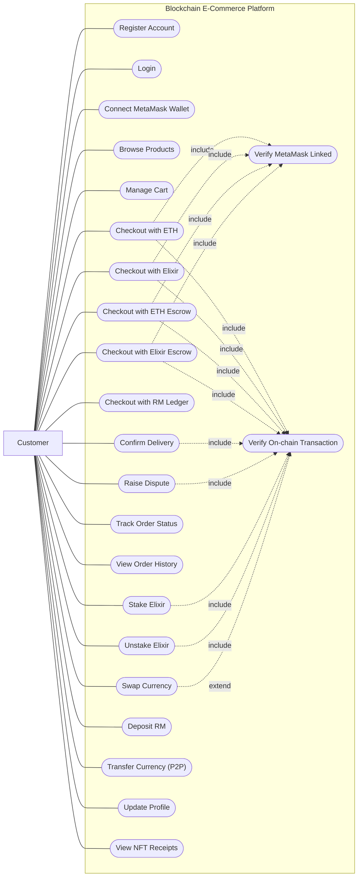
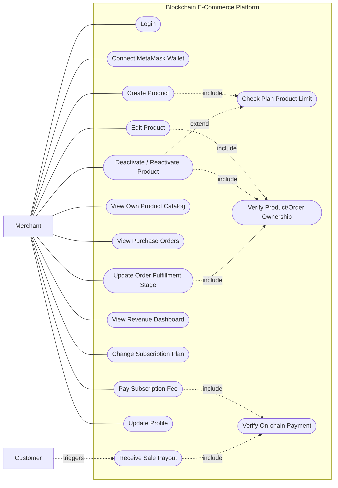
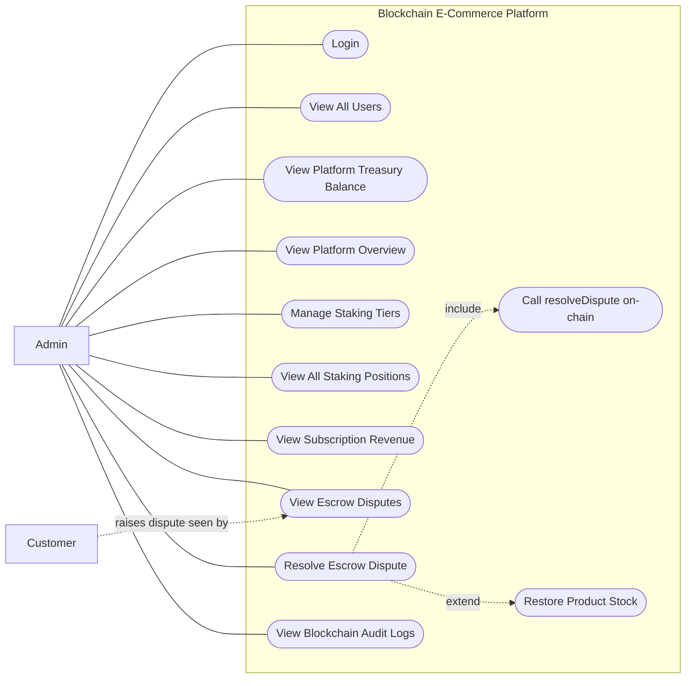
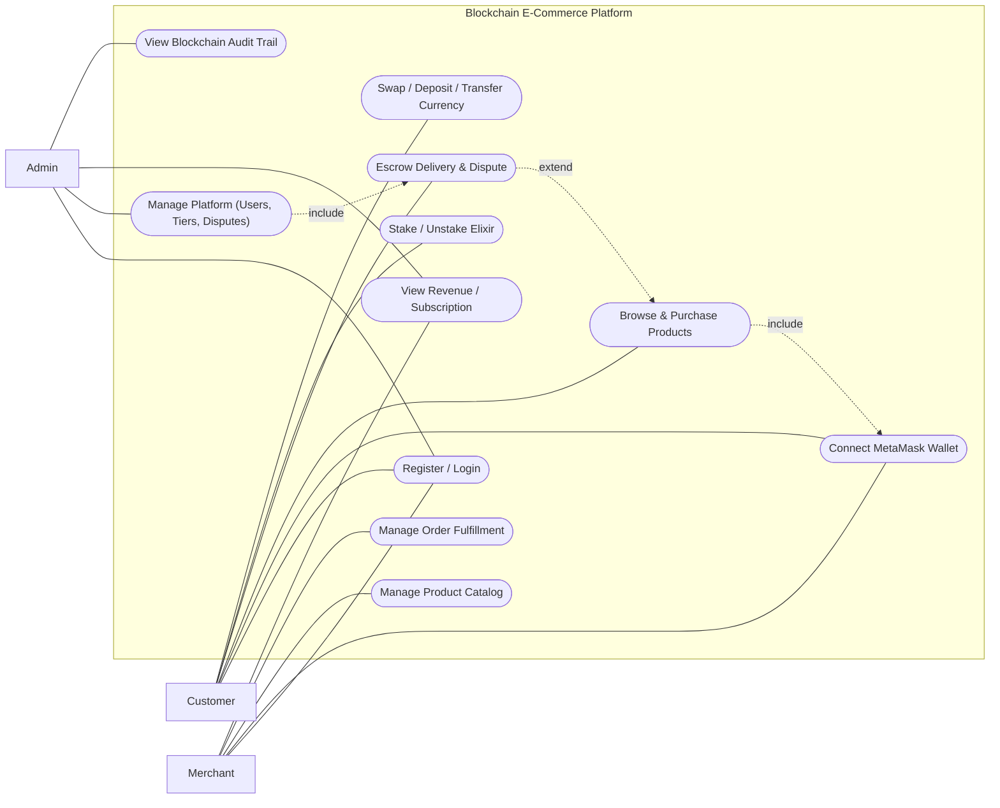

# Use Case Diagrams — Blockchain E-Commerce Platform

> **Note on Mermaid support:** Mermaid has no native `usecaseDiagram` type
> (unlike `classDiagram`, `sequenceDiagram`, or `erDiagram`). These diagrams
> are built using `flowchart` syntax as a standard workaround: actors are
> rectangles outside a system boundary, use cases are stadium-shaped nodes
> `([Text])` inside a `subgraph` boundary box, and `<<include>>`/`<<extend>>`
> relationships are dashed arrows between use cases. This is the same
> convention widely used when a tool lacks a dedicated use case renderer.

Because there's no dedicated Mermaid type, draw.io's Mermaid converter is
more likely to fall back to **Image** mode for these (same as the earlier
activity diagrams did). If a diagram renders as native shapes but drops the
system boundary title, use the Image insert option or the mermaid.live →
export SVG → drag-in method described in `activity-diagrams-drawio.md`.
Alternatively, draw.io also ships **native UML Use Case shapes** (actors,
ellipses, system boundary) in its left-hand shape library — search "UML" in
the shape search box — which you can use to redraw these manually with exact
visual UML notation if the Mermaid conversion isn't clean enough.

Each diagram is derived directly from the role-gated routes in
`backend/routes/*.routes.js` (via `requireRole`) and the corresponding
frontend pages, not a generic template.

---

## 1. Use Case Diagram — Customer

---

## 2. Use Case Diagram — Merchant (Seller)

---

## 3. Use Case Diagram — Admin

---

## 4. Combined Overview — All Roles

---

## Getting these into draw.io or Figma

**draw.io:**
1. Open **Arrange → Insert → Mermaid**.
2. Paste one diagram's code, starting from `flowchart LR`.
3. Click **Insert**.
4. If the system boundary title or stadium shapes look wrong, switch the
   insert option to **Image**, or use the mermaid.live → export SVG →
   drag-in method.
5. Alternatively, use draw.io's built-in **UML → Use Case** shape library
   (search "UML" in the left shape panel) to manually place actor stick
   figures, ellipses, and a system boundary rectangle with exact UML
   notation — this avoids the Mermaid conversion step entirely.

**Figma:**
Paste into [mermaid.live](https://mermaid.live), export as SVG, and drag the
file onto your Figma canvas — same approach as the other diagrams, since I
don't have a tool that draws directly onto a Figma canvas.

---

## Relationship Reference — Include / Extend (draw.io version)

This table lists every `<<include>>` and `<<extend>>` relationship in the
draw.io diagram opened directly in your editor (the one styled after your
reference image), grouped by actor cluster. "Base" is the use case that owns
the relationship arrow; "Related" is the use case it points to.

### Customer

| Base use case | Relationship | Related use case |
|---|---|---|
| Browse Products | `<<include>>` | Search / Filter Products |
| Browse Products | `<<include>>` | View Product Details |
| Manage Cart | `<<extend>>` | Add to Cart |
| Checkout | `<<include>>` | Verify MetaMask Linked |
| Checkout with ETH | `<<extend>>` | Checkout |
| Checkout with Elixir | `<<extend>>` | Checkout |
| Checkout with ETH Escrow | `<<extend>>` | Checkout |
| Checkout with Elixir Escrow | `<<extend>>` | Checkout |
| Checkout with RM | `<<extend>>` | Checkout |
| Track Order Status | `<<include>>` | View Order History |
| Confirm Delivery | `<<include>>` | Verify On-chain Transaction |
| Raise Dispute | `<<include>>` | Verify On-chain Transaction |
| Manage Elixir Wallet | `<<include>>` | Stake Elixir |
| Manage Elixir Wallet | `<<include>>` | Unstake Elixir |

**How to read the checkout relationships:** "Checkout" is the base use case that
always requires MetaMask (`<<include>>`, mandatory). Each of the five payment
modes (ETH / Elixir / ETH Escrow / Elixir Escrow / RM) is drawn as
`<<extend>>` **into** Checkout — meaning Checkout is optionally extended by
whichever single payment mode the customer picks at that moment, not all
five at once.

### Merchant

| Base use case | Relationship | Related use case |
|---|---|---|
| Manage Product Catalog | `<<include>>` | Create Product |
| Manage Product Catalog | `<<include>>` | Edit Product |
| Manage Product Catalog | `<<extend>>` | Deactivate / Reactivate Product |
| Create Product | `<<include>>` | Check Plan Product Limit |
| Manage Purchase Orders | `<<include>>` | View Purchase Orders |
| Manage Purchase Orders | `<<extend>>` | Update Fulfillment Stage |
| Manage Subscription | `<<include>>` | View Revenue Dashboard |
| Manage Subscription | `<<include>>` | Pay Subscription Fee |
| Manage Subscription | `<<extend>>` | Change Subscription Plan |

### Admin

| Base use case | Relationship | Related use case |
|---|---|---|
| Manage Staking Tiers | `<<include>>` | View All Staking Positions |
| Resolve Escrow Dispute | `<<include>>` | View Escrow Disputes |

### Cross-actor (Admin ↔ Customer)

| Base use case | Relationship | Related use case |
|---|---|---|
| Resolve Escrow Dispute (Admin) | `<<extend>>` | Raise Dispute (Customer) |

This is the one relationship that crosses actor clusters — it shows that an
admin's dispute resolution is a follow-on action extending the customer's
original "Raise Dispute" use case, mirroring how the reference diagram had
Admin/Parent use cases reaching back into the Gamer cluster.

### Quick rule of thumb used across all of the above

- **`<<include>>`** — the related use case is a **mandatory step always
  performed** as part of the base use case (e.g. Checkout always includes
  verifying MetaMask is linked).
- **`<<extend>>`** — the related use case is an **optional/conditional
  variant** that only runs in specific circumstances (e.g. only one of the
  five payment-mode use cases extends Checkout per transaction; fulfillment
  update only extends order management when the merchant chooses to advance
  a stage).
